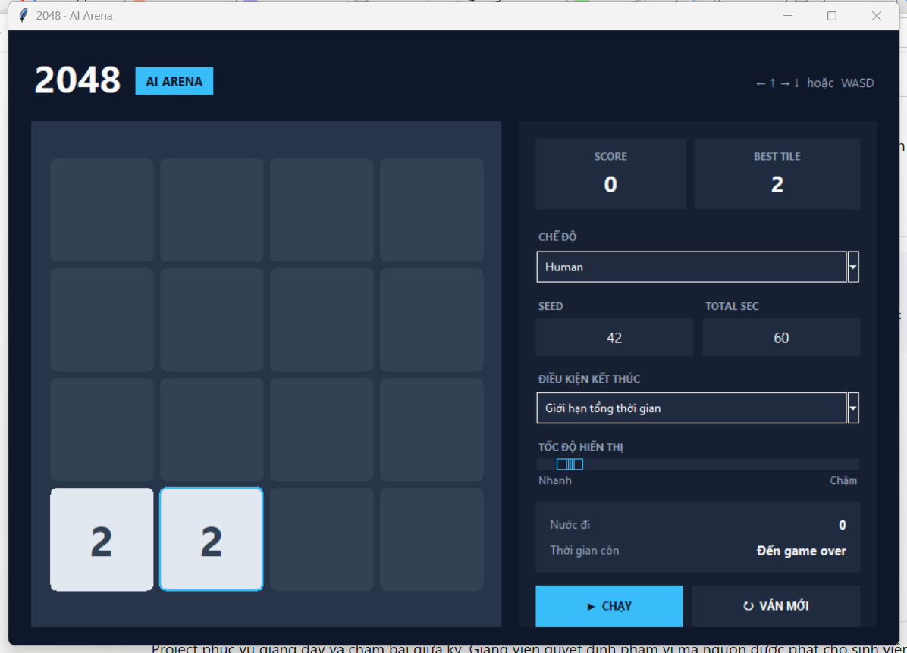

# 2048 AI Midterm

Project giữa kỳ xây dựng thuật toán chơi **2048 chuẩn trên bàn 4×4**. Sinh viên
nhận engine, giao diện, công cụ benchmark và một starter agent; nhiệm vụ là thiết
kế heuristic, search và chiến lược phân bổ thời gian trong thư mục `student/`.

Project chạy CPU bằng Python, không yêu cầu Conda và không cần GPU.

<p align="center">
  
</p>

## Tính năng

- Engine 2048 chuẩn, deterministic theo seed;
- giao diện **2048 AI Arena** cho người chơi và AI;
- API thống nhất cho mọi agent;
- benchmark theo tổng ngân sách suy nghĩ của cả ván;
- xuất kết quả JSON và thống kê điểm;
- tournament trên cùng bộ seed;
- test cho luật chơi, RNG, API và tính tái lập;
- Boss 0 Random công khai để kiểm tra engine và API;
- điểm tham khảo Boss 0–2 được công bố mà không phát hành source Boss 1–2.

## Luật chơi

| Thành phần | Quy tắc |
|---|---|
| Bàn cờ | 4×4 |
| Trạng thái đầu | Hai ô được sinh ngẫu nhiên |
| Điều khiển | Lên, xuống, trái hoặc phải |
| Ô mới | `2` với xác suất 90%, `4` với xác suất 10% |
| Gộp ô | Hai ô liền nhau cùng giá trị gộp thành một ô gấp đôi |
| Giới hạn gộp | Một ô chỉ được tham gia gộp một lần trong một nước |
| Nước hợp lệ | Nước phải làm thay đổi bàn cờ |
| Kết thúc | Không còn nước hợp lệ |

Sau mỗi nước hợp lệ, các ô trượt và gộp trước, sau đó engine mới sinh một ô
`2` hoặc `4` tại vị trí trống.

Ví dụ khi đi sang trái:

```text
[2, 2, 2, 2]  →  [4, 4, 0, 0]   cộng 8 điểm
[2, 2, 4, 0]  →  [4, 4, 0, 0]   cộng 4 điểm
[4, 4, 8, 8]  →  [8,16, 0, 0]   cộng 24 điểm
```

## Cách tính điểm

Điểm dùng đúng luật 2048: mỗi lần hai ô gộp lại, cộng giá trị của ô mới vào
tổng điểm.

| Phép gộp | Điểm nhận được |
|---|---:|
| `2 + 2 → 4` | 4 |
| `4 + 4 → 8` | 8 |
| `128 + 128 → 256` | 256 |
| `1024 + 1024 → 2048` | 2048 |

Ô lớn nhất không được cộng riêng lần nữa. Ví dụ một ván kết thúc ở tile 2048
không mặc định được 2048 điểm; tổng điểm là tổng của **mọi lần gộp** trong ván.

### Chỉ số chấm chính

Mỗi agent chơi trên cùng các hidden seed và cùng tổng ngân sách suy nghĩ. Chỉ số
chính thức là:

```text
Official Score = trung bình điểm 2048 cuối ván trên các hidden seed
```

Mỗi seed tạo một ván độc lập. Cấu hình chuẩn dùng **60 giây tổng thời gian suy
nghĩ cho mỗi ván**, không đặt giới hạn cố định cho từng nước. Agent phải tự quyết
định khi nào đi nhanh và khi nào cần search lâu hơn.

`max_tile`, số bước, tỷ lệ đạt 2048/4096 và thời gian trung bình mỗi quyết định
được lưu để phân tích, nhưng không thay thế điểm 2048 chính. `illegal_moves` và
`exceptions` phải bằng 0.

## Cấu trúc project

```text
.
├── README.md
├── INSTALLATION.md
├── requirements.txt
├── pyproject.toml
├── assets/ui-preview.png  # ảnh giao diện dùng trong README
├── src/game2048/          # engine và API công khai
├── student/
│   ├── agent.py           # file sinh viên bắt đầu sửa
│   └── examples/          # agent mẫu tối thiểu
├── scripts/               # UI, benchmark, tournament
├── tests/                 # test tự động
└── results/               # kết quả benchmark cục bộ
```

Sinh viên chỉ cần sửa `student/agent.py` hoặc tạo thêm module bên trong
`student/`. Không sửa engine và không import code từ `instructor/`.

## Cài đặt

Project hỗ trợ Python 3.10 trở lên. Hướng dẫn chi tiết nằm tại
[INSTALLATION.md](INSTALLATION.md).

Cài nhanh:

```powershell
python -m pip install -r requirements.txt
python -m pip install -e .
python -m pytest -q
```

Conda không bắt buộc. Sinh viên có thể dùng Python hệ thống, `venv` hoặc bất kỳ
trình quản lý môi trường nào.

## Chạy giao diện

```powershell
python scripts/play.py --seed 42
```

Trong UI có thể:

- chơi tay bằng phím mũi tên hoặc WASD;
- chọn Boss 0 Random hoặc Student agent;
- thay seed và `TOTAL SEC` trực tiếp trong UI;
- chọn **Giới hạn tổng thời gian** để dừng khi hết budget, hoặc **Chạy đến
  game over** để chơi hết ván;
- chạy, tạm dừng hoặc tạo ván mới;
- điều chỉnh tốc độ hiển thị mà không ảnh hưởng thời gian suy nghĩ.

Chế độ Human luôn chơi đến game over. Bản nội bộ của giảng viên tự nhận diện
Boss 1–4 trên máy local; public starter không có source các Boss này nên UI
public chỉ hiện Human, Boss 0 và Student agent.

Chạy trực tiếp agent sinh viên:

```powershell
python scripts/play_agent.py --agent student.agent:Agent --seed 42
```

Chạy Boss 0 Random:

```powershell
python scripts/play_agent.py --agent student.examples.random_agent:Agent --seed 42
```

UI dùng để quan sát và debug. Kết quả đánh giá phải lấy từ benchmark.

## API dành cho sinh viên

Giữ nguyên tên lớp `Agent` và hai phương thức sau:

```python
from game2048.observation import Observation
from game2048.types import Move


class Agent:
    name = "ten-nhom"

    def reset(self, seed: int | None = None) -> None:
        """Xóa cache hoặc trạng thái của ván trước."""

    def choose_move(self, obs: Observation, time_limit_ms: float) -> Move:
        """Trả về một nước nằm trong obs.legal_moves."""
```

### Dữ liệu trong `Observation`

| Trường | Kiểu | Ý nghĩa |
|---|---|---|
| `board` | NumPy array 4×4 | Bản sao bàn cờ chỉ đọc |
| `score` | `int` | Điểm hiện tại |
| `move_count` | `int` | Số nước hợp lệ đã đi |
| `legal_moves` | tuple `Move` | Các nước được phép chọn |
| `time_remaining_ms` | `float` hoặc `None` | Tổng thời gian còn lại |
| `total_time_limit_ms` | `float` hoặc `None` | Tổng budget ban đầu |

Trong chế độ tổng budget, `time_limit_ms` là giới hạn hiệu dụng còn lại của cả
ván, không có nghĩa agent nên dùng hết giá trị đó ở nước hiện tại.

Starter trong `student/agent.py` là heuristic one-ply hợp lệ nhưng cố ý chưa
mạnh. Sinh viên có thể phát triển thêm heuristic, Expectimax, sampling,
transposition table hoặc iterative deepening.

## Benchmark

### Test nhanh một seed trong 5 giây

```powershell
python scripts/benchmark_agent.py --agent student.agent:Agent --seeds 1 --start-seed 42 --total-time-sec 5
```

### Cấu hình 60 giây

```powershell
python scripts/benchmark_agent.py --agent student.agent:Agent --seeds 1 --start-seed 42 --total-time-sec 60
```

### Nhiều seed và lưu JSON

```powershell
python scripts/benchmark_agent.py `
  --agent student.agent:Agent `
  --seeds 5 `
  --start-seed 1000 `
  --total-time-sec 60 `
  --output results/student_validation.json
```

Không thêm `--time-ms` trong cấu hình tổng budget thông thường. Chỉ dùng tham
số đó nếu đề bài yêu cầu thêm một giới hạn cứng cho từng nước.

## Mốc điểm Boss 0–2

Repository public chỉ có Boss 0 Random để kiểm tra API. Source Boss 1–4 được giữ
riêng bởi giảng viên; sinh viên nhận kết quả tham khảo của Boss 0–2.

Protocol: seed 42, bàn 4×4, tối đa 60 giây tổng thời gian suy nghĩ, không có
giới hạn cố định mỗi nước.

| Mốc | Điểm | Tile lớn nhất | Số bước |
|---|---:|---:|---:|
| Boss 0 · Random | 1.352 | 128 | 140 |
| Boss 1 | 2.032 | 128 | 189 |
| Boss 2 | 7.448 | 512 | 518 |

Đây là kết quả tham khảo trên một seed để định hướng, không phải ngưỡng điểm
bắt buộc và không phải ước lượng thống kê trên nhiều seed. Điểm của Boss 3 và
Boss 4 chưa được công bố và sẽ được thông báo sau. Chấm chính thức vẫn dùng
trung bình điểm 2048 trên hidden seed.

Sinh viên không bắt buộc đánh bại Final Boss. Điểm được xác định bằng metric
chung, không phải bằng một trận đối kháng trực tiếp với Boss.

## Bài nộp

Sinh viên nộp toàn bộ thư mục `student/`, tối thiểu phải có `student/agent.py`.
Nếu `agent.py` import thêm `heuristic.py`, `search.py` hoặc file dữ liệu thì phải
nộp kèm các file đó. Không cần nộp engine, UI, tests hay thư mục `results/`.

## Quy định kỹ thuật

- CPU-only, một process và một thread khi chấm;
- không Cython, native extension, GPU hoặc deep learning;
- không truy cập mạng trong lúc chạy;
- không đọc seed ẩn, RNG hoặc lần sinh ô tiếp theo của engine;
- không sửa `obs.board`;
- không hard-code benchmark seed;
- mọi dependency bổ sung phải được giảng viên cho phép;
- bài nộp phải tái lập được khi nhận cùng trạng thái và cùng seed nội bộ.

Nếu agent trả nước sai, phát sinh exception hoặc vượt tổng budget, benchmark sẽ
dừng ván và ghi nguyên nhân vào kết quả.

## Kiểm tra trước khi nộp

```powershell
python -m pytest -q
python -m compileall -q student
python scripts/benchmark_agent.py --agent student.agent:Agent --seeds 1 --start-seed 42 --total-time-sec 5
```

Checklist:

- [ ] Import được `student.agent:Agent`;
- [ ] `illegal_moves = 0` và `exceptions = 0`;
- [ ] không sửa engine hoặc import `instructor/`;
- [ ] không dùng Cython, GPU, mạng hoặc đa tiến trình;
- [ ] nộp đủ mọi file được import bên trong `student/`;
- [ ] thuật toán không tiêu toàn bộ budget ở nước đầu.

## License và sử dụng

Project phục vụ giảng dạy và chấm bài giữa kỳ. Giảng viên quyết định phạm vi mã
nguồn được phát cho sinh viên và quy định nộp bài áp dụng cho từng lớp.
